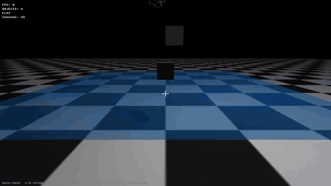

# Physics Engine

A real-time 3D physics sandbox written from scratch in C++17 and OpenGL 3.3. The maths
library (vectors, matrices) is hand-written; no GLM.



## Features

- **Rigid-body dynamics:** cubes and spheres with impulse-based collision response,
  restitution and Coulomb friction. Sphere–sphere, sphere–ground and AABB–ground
  collision detection.
- **Height-field water:** a wave-equation surface with damping. Objects that hit it make
  splashes, and Archimedes buoyancy and drag act on everything in it.
- **Interaction:** raycast picking to grab and throw objects; a build mode for placing and
  deleting objects; impact particles on collisions.
- **Rendering:** custom GLSL shaders with Phong lighting, 2048px shadow mapping, a skybox,
  procedural textures, OBJ model loading and a bitmap-font HUD.
- **Scenes:** quick-save and load of the whole scene, including the light position.

## Building

Requires a C++17 compiler (GCC 9+, Clang 10+ or MSVC 2019+), CMake 3.20+, Git and an
OpenGL 3.3 GPU. CMake downloads GLFW automatically; GLAD and stb_image are included in
`thirdparty/`.

### CLion

Open the folder, let CMake configure, then press Run.

### Command line

```bash
cmake -S . -B build -DCMAKE_BUILD_TYPE=Release
cmake --build build
./build/PhysicsEngine
```

## Controls

| Input | Action |
|---|---|
| WASD, mouse | Move and look |
| Left mouse (hold) | Grab the object under the crosshair |
| Right mouse (while holding) | Throw it |
| E / R | Spawn a cube (cycles materials) / a sphere |
| G | Splash the water where you're aiming |
| B | Toggle build mode |
| Build mode: left mouse / F / X | Place an object / switch cube or sphere / delete the aimed object |
| Arrow keys, Page Up / Page Down | Move the light |
| H | Toggle shadows |
| Ctrl+S / Ctrl+L | Save / load the scene |
| Escape | Quit |

## Project structure

```
src/
  main.cpp      Entry point, input and the main loop
  core/         Application loop and timing
  math/         Vec3 and Mat4 (own maths library)
  physics/      Rigid bodies, collision detection and response, physics world
  renderer/     Shaders, meshes, camera, water, particles, skybox, text, raycasting
  scene/        Scene objects and save/load
shaders/        GLSL vertex and fragment shaders
assets/         OBJ models
thirdparty/     GLAD and stb_image
docs/           README media
```

## In progress

`src/physics/FluidSystem` is an SPH fluid solver (poly6 and spiky kernels) with a
spatial hash grid for neighbour search. It is not yet part of the build.
